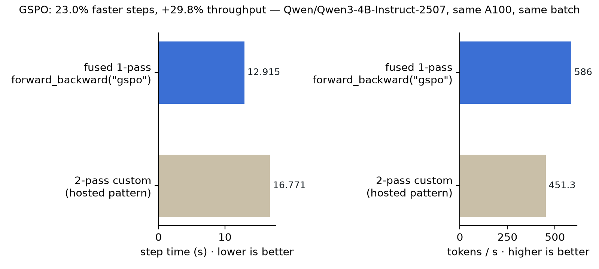
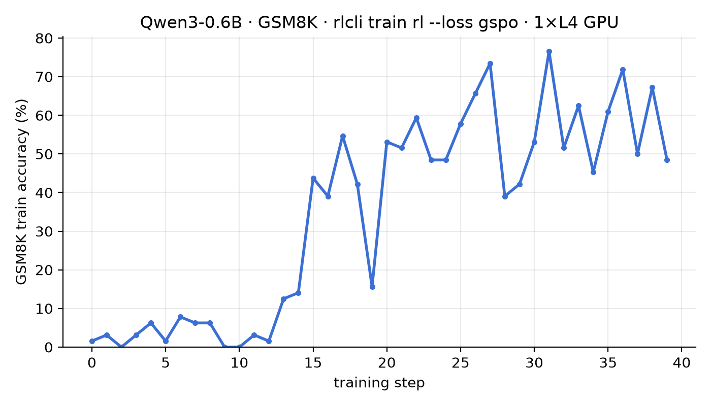

# rlcli — A CLI Interface for Continual Learning

rlcli runs fused GSPO on your own GPUs in one forward-backward call, the loss hosted Tinker does not serve. Backed by [SkyRL](https://github.com/NovaSky-AI/SkyRL), driven from your terminal.

rlcli is a Python CLI that runs fused RL losses like **GSPO** on your own GPUs in a single `forward_backward` call. Hosted Tinker does not serve GSPO natively: reproducing it there costs a 2-pass round-trip (fetch logprobs, compute the loss client-side, ship the reweighted batch back). rlcli gives you the fused 1-pass path locally, and [our benchmark](benchmarks/last_gspo_bench.json) measures a **23% step-time reduction and 29.8% throughput gain** on Qwen3-4B-Instruct-2507.

It is also the missing front door for the whole stack: the official `tinker` CLI has no `train` verb, and SkyRL has no CLI. rlcli wires them together so you can serve a model, run SFT or RL, and sample from checkpoints without leaving your terminal.

```bash
# serve a Tinker-API training server on your hardware
rlcli serve start --base-model Qwen/Qwen3-4B-Instruct-2507 --backend fsdp --gpus 8

# supervised fine-tune on your own conversations
rlcli train sl --model Qwen/Qwen3-4B-Instruct-2507 --dataset conversations.jsonl

# RL with the fused GSPO loss — one forward_backward call, not the 2-pass custom-loss path
rlcli train rl --model Qwen/Qwen3-4B-Instruct-2507 --loss gspo

# agent RL in sandboxed environments: Docker container + instruction + test script = reward
rlcli train harbor --model Qwen/Qwen3-4B-Instruct-2507 --loss gspo --dataset terminal-bench@2.0

# on-policy self-distillation: the same weights, given a privileged hint, teach the student
rlcli train opsd --model Qwen/Qwen3-4B-Instruct-2507 --dataset prompts.jsonl --teacher-hint "Think step by step and check your arithmetic."

# import your agent's chat dumps and fine-tune on them, all on your hardware
rlcli import prod-traces.jsonl -f openai | rlcli train sl --dataset - --model Qwen/Qwen3-4B-Instruct-2507

# the continual loop: verified traces -> synthesized sandbox tasks -> agent RL
rlcli import runs.jsonl -f langsmith --min-score 0.8 | rlcli synth - --out ./tasks --model gpt-5.2 
rlcli train harbor --model Qwen/Qwen3-4B-Instruct-2507 --dataset ./tasks --loss gspo
```

Docs: [docs.polygramme.com](https://docs.polygramme.com) · Install: `pip install polygramme-rlcli` (the `rlcli` command; PyPI reserves the bare name — not to be confused with `rl-cli`, Runloop's CLI).

## Benchmarks

Measured, with receipts in [`benchmarks/`](benchmarks/):

- **Fused GSPO vs 2-pass** ([json](benchmarks/last_gspo_bench.json)): same A100, same frozen batch — 12.9s vs 16.8s per step (−23%), 586 vs 451 tok/s (+29.8%).



- **GSM8K end-to-end** ([json](benchmarks/row1_gsm8k.json)): Qwen3-4B-Instruct-2507, 25 GSPO steps — 85.29% → 87.11% on the full 1,319-problem test set, for $3.52 of rented A100 time.
- **Cold start on a single L4**: Qwen3-0.6B goes from ~2% to ~60%+ GSM8K train accuracy in 40 GSPO steps.



## How it works

- `rlcli serve` manages a SkyRL Tinker server in its own uv venv (`~/.rlcli/server-venv`) — required because skyrl caps `tinker<=0.24.1` while the client uses 0.25.0; they meet over HTTP.
- Backends: `jax` (runs anywhere, CPU ok), `fsdp` / `megatron` (Linux + CUDA; serve the full loss set incl. `gspo`, `cispo`, `dppo`, `ppo_critic`).
- `rlcli train` invokes pinned [tinker-cookbook](https://github.com/thinking-machines-lab/tinker-cookbook) recipes programmatically. `--loss gspo` on a JAX server fails fast with a clear error.
- `rlcli train harbor` runs Harbor-format tasks (Dockerfile + instruction + test script) on your local Docker daemon — the test verdict is the reward. No cloud sandbox account needed.
- `rlcli train opsd` runs on-policy distillation from a prompts JSONL (`{"prompt": ...}` or `{"messages": [...]}`): the student samples, a teacher (`--teacher`: any base model or `tinker://` checkpoint on the server; default the student's own base) scores those tokens, and the negative reverse KL becomes the per-token advantage. `--teacher-hint TEXT` gives the teacher privileged context the student never sees.
- `rlcli checkpoint / run / session` pass through to the official tinker CLI, pointed at your server.
- Everything stays in your environment: traces, data, training, weights.

## Polygramme Cloud (hosted trainers)

The same server, on GPUs we run: [polygramme.com/cloud](https://polygramme.com/cloud).
`rlcli/cloud/` holds the two Modal apps (`trainer_app.py` = dedicated GPU,
`shared_app.py` = multi-tenant LoRA) and the product proxy they share
(`pg_proxy.py`: console keys, per-key ownership, metering, signed downloads,
merged full-weight export, and an OpenAI-compatible `/v1/chat/completions`
over any sampler checkpoint you own). Point any command at it with
`--base-url` and a console key; get the weights back with `/pg/checkpoints`.
Guide: [docs.polygramme.com/guides/cloud](https://docs.polygramme.com/guides/cloud).
Contract tests: `uv pip install -e ".[cloud,dev]" && pytest tests/test_pg_proxy.py`.

## Dataset format (`train sl`)

One JSON object per line:

```json
{"messages": [{"role": "user", "content": "hi"}, {"role": "assistant", "content": "hello"}]}
```

`rlcli import` produces this from common chat dumps: `-f openai`, `-f anthropic`
(content blocks incl. tool_use/tool_result), `-f messages` (roles normalized —
`human`→`user`, `ai`→`assistant`), `-f langsmith` (run exports; feedback scores
become a `reward` field, `--min-score` keeps only verified traces; or pull live
with `--project`, needs `pip install "polygramme-rlcli[langsmith]"`), `-f csv`
(one exchange per row), `-f vercel` (AI SDK `parts` messages).

**Tool calls are preserved by default** — assistant `tool_calls` and
`role: "tool"` results survive import in the exact shape the renderers train
on, so your agent's tool use is trainable, not stripped (`--drop-tools` for
text-only). **Telemetry as reward**: `--telemetry events.jsonl` joins product
events (`{"trace_id", "score"}` — thumbs-up, conversion, escalation) onto
conversations by caller-owned trace_id. **PII redaction** before anything is
written: `--redact email --redact api_key` (or `all`), plus custom
`--redact-pattern name=regex` — applied to message content and tool-call
arguments.

**Live capture**: `rlcli capture --upstream https://api.openai.com/v1 --out
traces.jsonl` runs a transparent OpenAI-compatible proxy — point your agent's
base_url at it and every completion (streaming included, tool calls included)
lands in an import-ready trace file.

## Trace → environment synthesis (`synth`)

`rlcli synth` turns imported traces into Harbor-format training environments: an
LLM (any OpenAI-compatible endpoint, including a local vLLM) drafts an
instruction + test script per conversation, rlcli scaffolds the task directory,
and validation builds the Docker image and requires the test to FAIL on an
untouched container — a test an idle agent passes is not a reward signal. Each
task.toml records lineage (`[synth]` source file/line + imported reward), and
the output directory feeds `rlcli train harbor --dataset ./tasks` directly.

## Development

```bash
uv venv && uv pip install -e ".[dev]"
pytest                       # includes the wire-compat test for extended losses
uv pip install -e ".[train]" "tinker-cookbook @ git+https://github.com/thinking-machines-lab/tinker-cookbook@f46eddde86e5397138917516a6c69d2ecbf538b1"  # train commands (PyPI forbids the git pin inside the extra)
```

Policy: tinker and tinker-cookbook are pinned dependencies; we do not carry patches against them — compatibility lives in `rlcli/compat.py` and is re-verified by tests on every pin bump.

## Roadmap

Richer environment synthesis (multi-turn tasks, rubric graders, solution replay) → PII redaction → on-policy distillation and multi-tenant LoRA → the scheduled continual-learning loop.

Apache-2.0.
